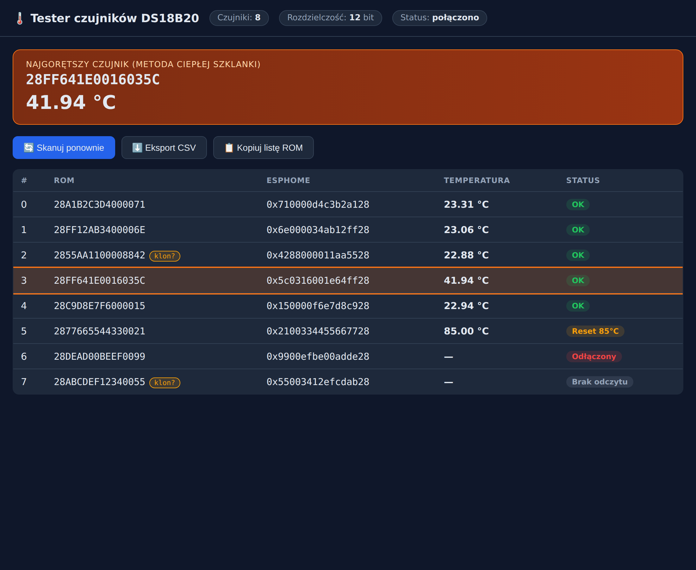
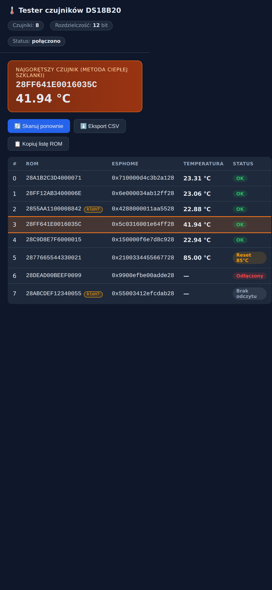

# esp32-ds18b20-tester

[](https://github.com/hubertciebiada/esp32-ds18b20-tester/actions/workflows/build.yml)
[](LICENSE)
[](https://platformio.org/)
[](https://platformio.org/frameworks/arduino)

Standalone warsztatowy tester czujników DS18B20 na ESP32 — skan magistrali 1-Wire,
podgląd pełnych adresów ROM i temperatur na lokalnej stronie WWW, identyfikacja
pojedynczych czujników metodą ciepłej szklanki (podświetlenie najgorętszego).

W pełni samodzielny — **bez** integracji z Home Assistant / MQTT / ESPHome / chmurą.
Pełna specyfikacja w [`SPEC.md`](SPEC.md).

## Podgląd

Strona WWW automatycznie odświeża się co sekundę. Wiersz z najwyższą temperaturą
jest wyraźnie podświetlony — wkładasz czujniki po kolei do ciepłej wody i od razu
widzisz, który ROM „skoczył".

| Desktop | Mobile |
|---------|--------|
| [](docs/img/web-desktop.png) | [](docs/img/web-mobile.png) |

> Zrzuty wygenerowane z mockowymi danymi (skrypt [`tools/screenshot.py`](tools/screenshot.py)) —
> renderuje realny front-end firmware bez podłączonego ESP32.

## Funkcje

- Skan magistrali przy starcie i na żądanie (przycisk **Skanuj ponownie**).
- Pełny 8-bajtowy adres ROM każdego czujnika w dwóch formatach:
  - czytelnym (16 znaków hex, wielkie litery, np. `28FF641E0016035C`),
  - gotowym do wklejenia do ESPHome (`address`, np. `0x5c0316001e64ff28`).
- Nieblokujący odczyt temperatur (`millis()`, jedna wspólna konwersja Skip ROM) —
  web server pozostaje płynny, w pętli głównej brak `delay()`.
- Strona WWW z auto-odświeżaniem co 1 s: tabela ROM / temperatura / status,
  **wyraźne podświetlenie najgorętszego czujnika** + jego ROM na górze.
- Eksport CSV, kopiowanie listy ROM do schowka.
- Diagnostyka per czujnik: `reset85` (85,00 °C), `disconnected` (-127 °C),
  `noread` (brak/NaN). Czujniki z błędem są wykluczane z wyliczania maksimum.
- Flaga prawdopodobnego klona (ROM niezgodny ze wzorcem `28-xx-xx-xx-xx-00-00-xx`).

## Sprzęt

- ESP32 DevKit (`env:esp32dev`).
- Magistrala 1-Wire na **GPIO4**, jedna wspólna szyna.
- Rezystor pull-up **2,2 kΩ** między DQ a 3,3 V.
- Zasilanie 3-żyłowe (VDD / GND / DQ) na 3,3 V — **bez** parasite power.

## Konfiguracja

Wszystkie ustawienia znajdują się w stałych `#define` na górze pliku
[`src/main.cpp`](src/main.cpp): pin 1-Wire, rozdzielczość (domyślnie 12-bit),
maksymalna liczba czujników, dane WiFi.

Domyślnie urządzenie startuje jako **Access Point**:

| Parametr | Wartość |
|----------|---------|
| SSID     | `DS18B20-Tester` |
| Hasło    | `tester1234` (zmień przed użyciem!) |
| Adres    | `http://192.168.4.1` |

Aby użyć trybu **STA** (dołączenie do istniejącej sieci): ustaw `USE_WIFI_STA`
na `1` oraz odkomentuj i wypełnij `WIFI_STA_SSID` / `WIFI_STA_PASS`. Adres IP
odczytasz wtedy z monitora szeregowego (115200 baud).

## Build i flash (PlatformIO)

```bash
pio run                 # kompilacja
pio run -t upload       # wgranie na ESP32
pio device monitor      # podgląd logów (115200 baud)
```

Po wgraniu połącz się z siecią `DS18B20-Tester` i otwórz `http://192.168.4.1`.

## Endpointy HTTP

| Ścieżka       | Metoda | Opis |
|---------------|--------|------|
| `/`           | GET    | Strona WWW (HTML w PROGMEM) |
| `/data`       | GET    | JSON ze stanem wszystkich czujników |
| `/export.csv` | GET    | Pobranie listy czujników jako CSV |
| `/rescan`     | POST   | Zlecenie ponownego skanu magistrali |

## Dobór pull-up

Jeśli przy skanie gubią się czujniki, zejdź z 2,2 kΩ na **1,5 kΩ** — przy długiej
magistrali i wielu czujnikach mocniejszy pull-up szybciej podciąga linię. Gdy to
nie pomaga, podziel czujniki na **dwie osobne magistrale** na różnych GPIO.
